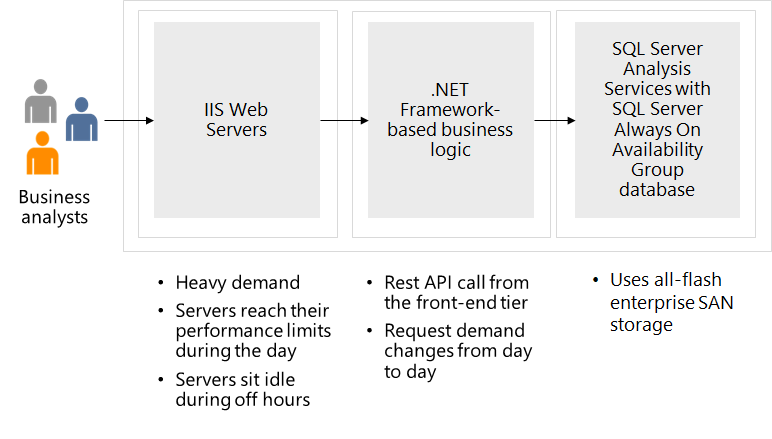

---
casestudy:
  title: Diseño de una solución de proceso
  module: Compute solutions
---

# Diseño de una solución de proceso

## Requisitos

Tailwind Traders quiere migrar su aplicación de catálogo de productos a la nube. Esta aplicación tiene una configuración tradicional de 3 niveles que usa SQL Server como almacén de datos. El equipo de TI espera que puedas ayudar a modernizar la aplicación. Han proporcionado este diagrama y varios aspectos que podrían mejorarse. 

* La aplicación front-end es una aplicación web basada en .NET Core. Durante los períodos máximos, 1750 clientes visitan el sitio web cada hora. 

* La aplicación se ejecuta en servidores web de IIS en un nivel de front-end. Este nivel controla todas las solicitudes de clientes para comprar productos. Durante las últimas rebajas de vacaciones, los servidores front-end alcanzaron sus límites de rendimiento y las páginas tardaban en cargar. El equipo de TI se ha planteado agregar más servidores, pero durante las horas de inactividad los servidores suelen estar inactivos.

* El nivel intermedio hospeda la lógica empresarial que procesa las solicitudes de los clientes. Estas solicitudes suelen ser de soporte técnico. Las solicitudes de soporte técnico se ponen en cola y, últimamente, los tiempos de espera han sido muy largos. Los clientes escriben correos electrónicos en lugar de esperar a un representante. Muchos clientes parecen frustrados y se desconectan en lugar de esperar. Hay de 75 a 125 solicitudes de clientes por hora. 

* El nivel de back-end usa la base de datos de SQL Server para almacenar los pedidos de los clientes. Actualmente, los servidores de base de datos del back-end funcionan bien.

* Aunque la alta disponibilidad es un problema, debido a los requisitos legales, la empresa debe mantener todos los recursos en una sola región.

## Tareas

* **Nivel de front-end**. ¿Qué servicio de proceso de Azure recomendarías para el nivel de front-end? Explica por qué has elegido esa solución. 

* **Nivel intermedio**. ¿Qué servicio de proceso de Azure recomendarías para el nivel intermedio? Explica por qué has elegido esa solución. 

¿Cómo incorporas los pilares del Marco de buena arquitectura para producir una arquitectura en la nube estable, eficiente y de alta calidad?
