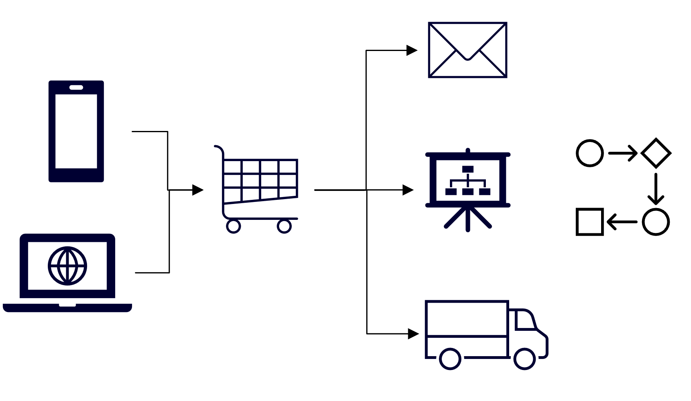

---
casestudy:
  title: Diseño de una solución de arquitectura de aplicaciones
  module: App architecture solutions
---
# Diseño de una solución de arquitectura de aplicaciones

## Requisitos

Tailwind Traders quiere actualizar su sitio web para incluir imágenes de producto proporcionadas por el cliente, además de las fotos ya existentes proporcionadas por marketing. Creen que tener más fotos de productos dará a los clientes potenciales una mejor idea de cuánto les gustaron los productos a los clientes anteriores tras comprarlos. Tienen algunos requisitos, como se describe a continuación:

* Las imágenes cargadas deberán examinarse antes de publicarse en el sitio web. Los departamentos jurídicos y de marketing solicitan que, después de la carga inicial, se compruebe que las imágenes no presenten ningún problema que pueda perjudicar a la empresa o causar problemas legales. Ya se ha desarrollado e implementado una API interna que puede llevar a cabo el análisis necesario. 

* En función de los patrones existentes, Tailwind Traders espera que las cargas de imágenes se produzcan de forma muy desigual durante todo el día. En algunos momentos puede haber más cargas de las que puede soportar el software de detección, mientras que en otros períodos puede haber muy pocas o ninguna.

* Una vez que el sistema haya examinado y aprobado una imagen cargada, Tailwind Traders quiere que al cliente se le envíe un correo electrónico para agradecerle que haya compartido la imagen.

* El coste y la administración de la solución son un problema, especialmente porque Tailwind Traders no está seguro de la popularidad que tendrá esta característica. Minimiza los costes y aprovecha las soluciones sin servidor siempre que sea posible.

 

 

## Tarea

Diseñe una arquitectura para las imágenes del cliente que se van a añadir al sitio web de la empresa. 

* ¿Dónde deben almacenarse las imágenes?

* ¿Cómo te asegurarás de que todas las imágenes se analicen incluso cuando las cargas superen la capacidad de análisis?

* Una vez aprobadas las imágenes y actualizada la base de datos del catálogo, ¿cómo se notificará al cliente? 

¿Cómo incorporas los pilares del marco de buena arquitectura para producir una arquitectura en la nube estable, eficiente y de alta calidad?

 
