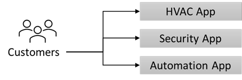

---
casestudy:
  title: Fabrikam Residences
  module: Logging and monitoring solutions
---
# Caso práctico de Fabrikam Residences

## Requisitos

**Este caso práctico requiere que hayas completado los siguientes módulos y casos prácticos: proceso, datos relacionales, datos no relacionales, autenticación, arquitectura de aplicaciones**

Has conseguido un nuevo puesto en Fabrikam Residences, una empresa de éxito que está experimentando un rápido crecimiento. Fabrikam Residences es un contratista del sector de la construcción para nuevas viviendas y grandes renovaciones residenciales, y ha alcanzado el éxito construyendo edificios de calidad y ofreciendo tecnologías residenciales integradas más novedosas que las de sus competidores.  

Actualmente, varias empresas independientes subcontratadas proporcionan y administran estas tecnologías. Los propietarios de Fabrikam Residences quieren empezar a ofrecer estas opciones tecnológicas novedosas de manera interna para proporcionar una mejor calidad, soporte técnico y datos sobre los patrones y necesidades de los clientes. 
 
Inicialmente, la empresa quiere ofrecer control y supervisión de HVAC (calefacción y aire acondicionado), supervisión y alertas del sistema de seguridad, y automatización del hogar. Esto requerirá un nuevo sitio web, una solución de almacenamiento de datos y una solución de ingesta de datos.

La empresa ha experimentado un gran crecimiento en los últimos 2 años. La empresa estima que puede duplicar su tamaño en los próximos 12-18 meses. Con este rápido crecimiento en el mercado regional, la empresa no tiene planes actuales para expandirse más allá.

## Situación actual

La sede de Fabrikam opera un pequeño centro de datos en una sola ubicación. El centro de datos hospeda el software de **administración de proyectos de la empresa**.

- El software de administración de proyectos usa una aplicación de Windows de terceros. La aplicación se ejecuta en un clúster de equilibrio de carga de red (NLB) de 2 nodos con un único back-end de Microsoft SQL Server.  

- Las imágenes y los documentos se almacenan en una unidad asignada del servidor, que se encuentra en un dispositivo NAS dedicado.

- Los usuarios corporativos y el personal de la oficina usan un front-end web para cambiar pedidos y especificar datos como las programaciones de entrega de suministros.

-   Los superintendentes de campo usan portátiles y tabletas Windows sin conexión para registrar continuamente el progreso de la construcción y otros detalles.  Estos cambios, como los nuevos pedidos de trabajo, se almacenan en un archivo de cambios local.  Al final de cada día, los superintendentes vuelven a la oficina para conectarse a la red inalámbrica y ejecutan un pequeño script para cargar el archivo de cambio en un servidor FTP.  Se programa un segundo script que se ejecuta cada noche para procesar todos los archivos de cambios y escribir su contenido en la base de datos de Administración de proyectos (Microsoft SQL Server).

El **software Home Technology** se proporciona y hospeda actualmente por parte de terceros e implica al menos tres sitios web diferentes que el cliente debe visitar.  Se propone reemplazar el software por una solución interna, desarrollada y unificada.

## Requisitos 

**Software de administración de proyectos**

- Migra tantos de los sistemas como sea posible a un proveedor de nube pública.

- Reemplaza los scripts existentes para aprovechar un sistema más seguro que FTP, ya que se han producido problemas de seguridad. Además, se te ha pedido que te asegures de que los archivos de cambios se procesan en cuanto se cargan.

- Aumenta la resiliencia de la base de datos de administración de proyectos. Aunque el rendimiento no es un problema, la empresa quiere evitar la pérdida de acceso a la base de datos en caso de un único error de hardware.

**Nueva solución de tecnología doméstica**

- Agrega una nueva solución para recopilar datos continuamente de los sensores de supervisión del hogar.
  - Crea una base de datos de algunas lecturas de sensores para analizar tendencias y hacer informes.
  - Proporciona alertas configurables en tiempo real en función de las necesidades del propietario.
  
- Diseña una solución de base de datos relacional para contener las preferencias y configuraciones del propietario de la vivienda.
  - El sistema debe ser escalable.
  - La redundancia es fundamental.
  
- El nuevo sitio web unificado se desarrollará de manera interna y se hospedará en Linux.  Este sitio web se usará para ver la supervisión y cambiar las preferencias de los elementos, como los umbrales de temperatura o de alerta. Las cargas pueden variar mucho y el sistema debe ser capaz de escalar rápidamente.

-   Proporciona a los usuarios una manera de iniciar sesión en el sistema sin crear otra cuenta de usuario y contraseña.

- Implementa controles de seguridad y proporciona informes semanales que describen cómo la empresa lleva a cabo los procedimientos recomendados estándar del sector.

## Tareas 

1. Diseña una solución para el software de administración de proyectos. Prepárate para explicar por qué elegiste cada componente del diseño y cómo cumple los requisitos de la solución.

2. Diseña una arquitectura para la nueva solución de tecnología doméstica. Prepárate para explicar por qué elegiste cada componente del diseño y cómo cumple los requisitos de la solución.

¿Cómo incorporas los pilares del Marco de buena arquitectura para producir una arquitectura en la nube estable, eficiente y de alta calidad?

