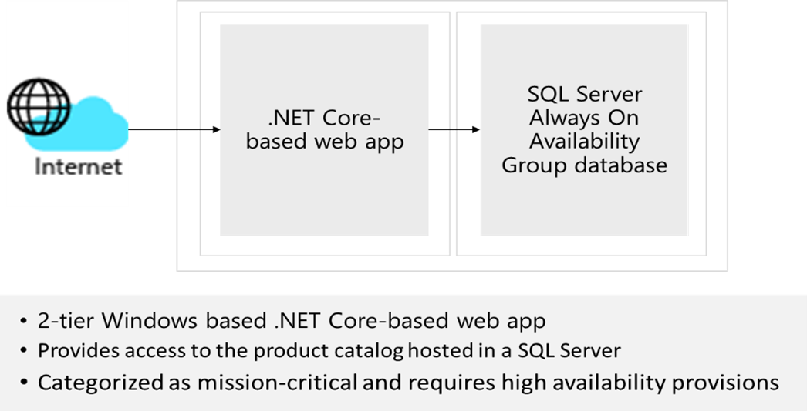

# Diseño de una solución de infraestructura de red  

## Requisitos

A medida que el equipo de TI de Tailwind Traders Enterprise se prepara para definir la estrategia para migrar algunas de las cargas de trabajo de la empresa a Azure, debe identificar los componentes de red necesarios y diseñar una infraestructura de red necesaria que los admita. Teniendo en cuenta el ámbito global de sus operaciones, Tailwind Traders va a usar varias regiones de Azure para hospedar sus aplicaciones. La mayoría de estas aplicaciones tienen dependencias de infraestructura y servicios de datos, que también residirán en Azure. Las aplicaciones internas migradas a Azure deben seguir siendo accesibles para los usuarios de Tailwind Traders. Las aplicaciones accesibles desde Internet migradas a Azure deben seguir siendo accesibles para cualquier cliente externo. 

Para crear el diseño de red inicial, el equipo de TI de Tailwind Traders Enterprise eligió dos aplicaciones clave, que son representativas de las categorías de cargas de trabajo más comunes que se esperan migrar a Azure.  

### Diseño: aplicación empresarial de catálogo de productos

- Una aplicación web de dos niveles basada en .NET Core y Windows y orientada a Internet que proporciona acceso al catálogo de productos y que está hospedada en una base de datos de grupo de disponibilidad Always On de SQL Server. Esta aplicación se clasifica como crítica, con un contrato de nivel de servicio de disponibilidad del 99,99 %, un objetivo de punto de recuperación de 10 minutos y un sistema operativo en tiempo real de 2 horas. 

-   Los clientes potenciales empresariales destacan la importancia de la experiencia óptima del cliente al acceder a aplicaciones accesibles desde Internet, por lo que es fundamental que se minimice el tiempo necesario para cargar páginas web y descargar contenido estático. Del mismo modo, un error de los servidores individuales que hospedan los componentes de la aplicación web y sus dependencias debería tener un impacto insignificante en la disponibilidad de la aplicación web percibida por los clientes. Aunque se entiende que un error regional podría generar alguna interrupción en las sesiones web existentes, la conmutación por error a un sitio de recuperación ante desastres debería ser automática.

- Para aprovechar las ventajas que ofrecen los servicios de Azure PaaS, el equipo de TI empresarial decidió implementar la base de datos de la aplicación empresarial de catálogo de productos mediante una base de datos de Azure SQL. 

- Los equipos de seguridad y riesgo de la información de Tailwind Traders requieren que toda la comunicación entre las máquinas virtuales de Azure y los servicios PaaS que forman parte de la misma aplicación debe realizarse a través de la red troncal de Azure, en lugar de a través de un punto de conexión público de los servicios PaaS. 

## Tareas: aplicación empresarial de catálogo de productos

1. Diseña una solución de red de dos niveles para el catálogo de productos. Si procede, el diseño podría incluir Azure Front Door, WAF, Azure Firewall y Azure Load Balancer. Los componentes de red deben agruparse en redes virtuales y se deben tener en cuenta los grupos de seguridad de red. Prepárate para explicar por qué elegiste cada componente del diseño. 

¿Cómo incorporas los pilares del Marco de buena arquitectura para producir una arquitectura en la nube estable, eficiente y de alta calidad?

